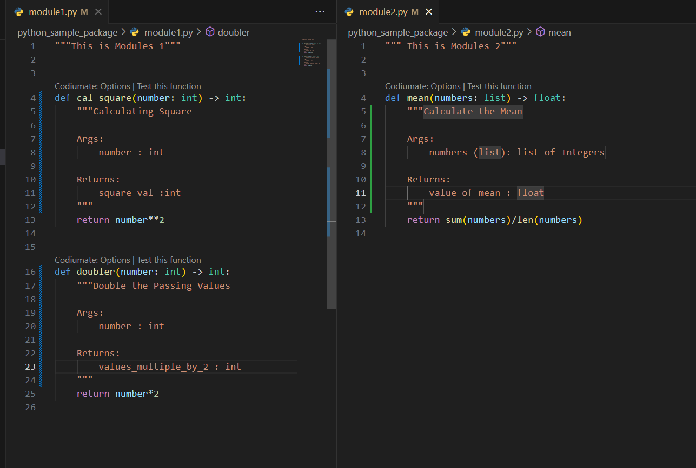

# Python Package

- Python packages are fundamental building blocks for writing well-organized and reusable Python code. They provide a way to structure your code into logical modules that can be easily imported and used in other parts of your project, or even shared with others as reusable libraries.
- InShort - Python Packages are a way to organize and structure your Python code into reusable components

### Here's a breakdown of what Python packages are and why they're important:

## Components of a Python Package:

- #### Modules: Individual Python files (.py) containing functions, classes, and variables that perform specific tasks.
- #### `__init__.py`: An optional file (can be empty) that indicates a directory is a package. It can also contain initialization code for the package.
- #### Hierarchical Structure: Packages can contain sub-packages, allowing for further organization and modularity.

## Purpose:

- Modularization: Break down complex projects into manageable, self-contained units, making them easier to understand, modify, and reuse.
- Code Reuse: Leverage common functions and components across different parts of your application, saving time and effort.
- Maintainability: Enhance code readability and maintainability by grouping related logic within a package structure.
- Collaboration: Facilitate teamwork by providing a shared codebase that others can readily import and use.
- Namespace Management: Avoid naming conflicts with functions or variables from other modules or the built-in Python library.

## Benefits:

- Improved Organization: Keep your codebase well-structured and organized, fostering better understanding and collaboration.
- Enhanced Reusability: Reduce code duplication and streamline development by leveraging pre-written modules.
- Simplified Maintenance: Easily modify or update individual components without affecting the entire codebase.
- Error Reduction: Promote clarity and consistency in coding practices, mitigating the risk of errors.
- Scalability: Design applications that can grow and adapt effortlessly by adding new modules as needed.

## How to make package... (follow)

### Steps:

- **Create a Directory:**
  Begin by creating a new directory for your package. This directory name will typically be the name of your package (e.g., my_package).

- **Create Modules:**
  Within your package directory, create individual Python modules (.py files) that contain your reusable functions, classes, and variables. Each module represents a specific functionality or set of related functionalities.

- `__init__.py` (Optional):
  While not strictly mandatory, an empty **init**.py file within the package directory is a common practice. This file signals to Python that the directory is a package and can be imported. It can also contain initialization code for your package, if needed.

**These are my step | How I Build Modules**

### Importing Package and Calling Modules

- **python_sample_package** Folder Name | for Simplicity

  - `__init__.py` File | Calling Each Modules
  - module1.py File | Define Function Which I will call in app.py
  - module2.py File |
    

- **app.py** Main File Where I called Function from Modules / Package.
  
- I get the data.

- I hope this will help for you
